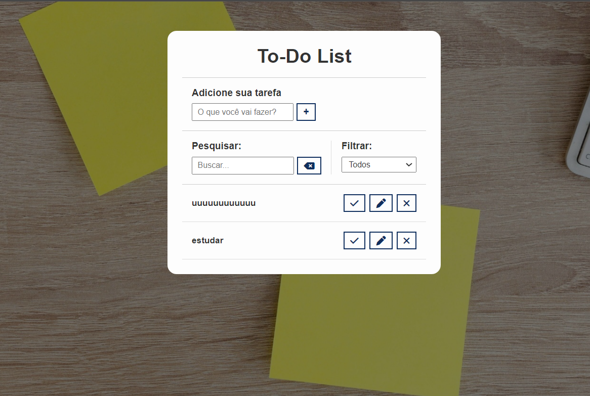

# 📝 To-Do List

## Descrição

Este projeto é uma **To-Do List** criada para facilitar o gerenciamento de tarefas diárias. Com uma interface simples e funcional, a aplicação permite ao usuário adicionar, editar, excluir, pesquisar e filtrar tarefas. O projeto foi desenvolvido utilizando **HTML**, **CSS** e **JavaScript**.

## Funcionalidades

- **Adicionar tarefas**: Insira uma nova tarefa na lista.
- **Pesquisar tarefas**: Busque por uma tarefa específica digitando no campo de pesquisa.
- **Filtrar tarefas**: 
  - **Todos**: Exibe todas as tarefas adicionadas.
  - **A fazer**: Exibe apenas as tarefas que ainda não foram concluídas.
  - **Feitos**: Exibe as tarefas já concluídas.
- **Editar tarefas**: Altere o nome ou status de uma tarefa existente.
- **Excluir tarefas**: Remova permanentemente uma tarefa da lista.

## Tecnologias Utilizadas

- **HTML**: Estrutura da página e organização dos elementos.
- **CSS**: Estilização da página para uma aparência agradável e responsiva.
- **JavaScript**: Funcionalidades interativas, como a adição, edição e remoção de tarefas.

## Prévia do Projeto

Aqui está uma prévia do site:



## Como Utilizar

1. Acesso à página web ⤵️
   
   https://raimegomes.github.io/to-do-list/

2. Clone este repositório:

   ```bash
   git clone https://github.com/SEU_USUARIO/todo-list.git

